# **GAME: "T-Kun's Journey" - SDL2**
---
## ***Video Demo :***   

---
## ***Table of Contents***
- [**GAME: "T-Kun's Journey" - SDL2**](#game-t-kuns-journey---sdl2)
  - [***Video Demo :***](#video-demo-)
  - [***Table of Contents***](#table-of-contents)
  - [1. HƯỚNG DẪN CÀI ĐẶT](#1-hướng-dẫn-cài-đặt)
      - [**Cách 1:**  Để khởi động trò chơi, double click vào file `main.exe`.](#cách-1--để-khởi-động-trò-chơi-double-click-vào-file-mainexe)
      - [**Cách 2:** Build file trong VSCode:](#cách-2-build-file-trong-vscode)
  - [2. MÔ TẢ CHUNG](#2-mô-tả-chung)
    - [Giới thiệu](#giới-thiệu)
    - [Cốt truyện](#cốt-truyện)
  - [3. CÁC THAO TÁC TRONG GAME](#3-các-thao-tác-trong-game)
    - [1. Khởi động game, chơi lại và thoát game:](#1-khởi-động-game-chơi-lại-và-thoát-game)
      - [***Ở mục MENU:***](#ở-mục-menu)
      - [***Khi vào game:***](#khi-vào-game)
      - [***Khi "phá đảo":***](#khi-phá-đảo)
    - [2. Cách chơi:](#2-cách-chơi)
      - [***Sử dụng "bàn phím" và "chuột"***:](#sử-dụng-bàn-phím-và-chuột)
  - [4. KỸ THUẬT LẬP TRÌNH](#4-kỹ-thuật-lập-trình)
    - [***Phát triển trên nền tảng ngôn ngữ C++ và thư viện SDL2:***](#phát-triển-trên-nền-tảng-ngôn-ngữ-c-và-thư-viện-sdl2)
    - [***Các kỹ thuật lập trình:***](#các-kỹ-thuật-lập-trình)
    - [***Ứng dụng:***](#ứng-dụng)
  - [5. TÀI LIỆU THAM KHẢO](#5-tài-liệu-tham-khảo)
  - [6. CÁC HƯỚNG ĐI TRONG TƯƠNG LAI](#6-các-hướng-đi-trong-tương-lai)
    - [1. Nâng cấp và cải thiện gameplay:](#1-nâng-cấp-và-cải-thiện-gameplay)
    - [2. Phát triển đồ họa và âm thanh:](#2-phát-triển-đồ-họa-và-âm-thanh)
    - [3. Tích hợp câu chuyện và thế giới:](#3-tích-hợp-câu-chuyện-và-thế-giới)
    - [4. Tích hợp tính năng mạng xã hội hoặc multiplayer:](#4-tích-hợp-tính-năng-mạng-xã-hội-hoặc-multiplayer)
    - [5. Xây dựng cộng đồng và marketing:](#5-xây-dựng-cộng-đồng-và-marketing)
    - [6. Phát triển lên các nền tảng khác:](#6-phát-triển-lên-các-nền-tảng-khác)
    - [7. Tạo DLC hoặc phần tiếp theo:](#7-tạo-dlc-hoặc-phần-tiếp-theo)
    - [8. Tư bản hóa trò chơi: Hệ thống nạp tiền Pay to Play:](#8-tư-bản-hóa-trò-chơi-hệ-thống-nạp-tiền-pay-to-play)
  - [7. KẾT LUẬN](#7-kết-luận)
    - [Việc hoàn thiện 1 dự án lập trình như thế này giúp em mở mang kiến thức rất nhiều:](#việc-hoàn-thiện-1-dự-án-lập-trình-như-thế-này-giúp-em-mở-mang-kiến-thức-rất-nhiều)
    - [Khuyết điểm:](#khuyết-điểm)
    - [Lời kết:](#lời-kết)
- [Em xin chân thành cảm ơn thầy, cô, các bạn và mọi người đã dành thời gian để đọc. ❤️❤️](#em-xin-chân-thành-cảm-ơn-thầy-cô-các-bạn-và-mọi-người-đã-dành-thời-gian-để-đọc-️️)

---
## 1. HƯỚNG DẪN CÀI ĐẶT
#### **Cách 1:**  Để khởi động trò chơi, double click vào file `main.exe`.
#### **Cách 2:** Build file trong VSCode:
       g++ -Isrc/include -Lsrc/lib -o main src/main.cpp src/CommonFunc.cpp src/BaseObject.cpp src/gamemap.cpp src/MainObject.cpp src/ImpTimer.cpp src/BulletObject.cpp src/ThreatObject.cpp src/PlayHealth.cpp src/TextObject.cpp -lmingw32 -lSDL2main -lSDL2 -lSDL2_image -lSDL2_ttf -lSDL2_mixer
**Chạy file bằng lệnh:* `./main`

---
## 2. MÔ TẢ CHUNG
### Giới thiệu
- Game "T-Kun's Journey" là một tựa game thể loại platform.
- Người chơi phải liên tục di chuyển linh hoạt để vượt qua các địa hình hiểm trở, tiêu diệt quái vật để đến đích.
- Trên đường đi liên tục nhặt "trái tim" để dành được số điểm cao nhất.
- Người chơi thua cuộc khi bị chết quá 4 lần và chiến thắng khi đến đích.
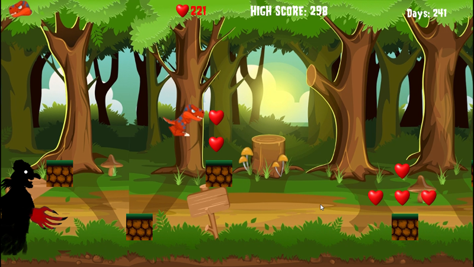  
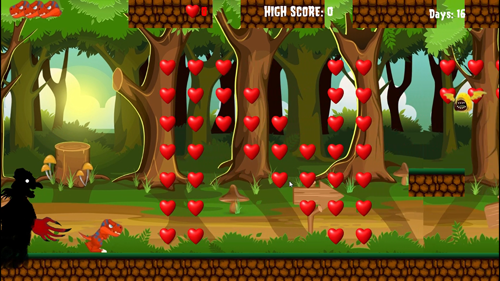

### Cốt truyện
(Thế giới giả tưởng)

Trong thế giới huyền bí của kỷ Jura, khi mặt đất vẫn trải đầy rừng rậm và thung lũng, có một câu chuyện cảm động về tình yêu và sự dũng cảm.

Cô bé khủng long tên là Isha, là một cô bé tinh nghịch và đáng yêu, luôn mơ mộng về những cuộc phiêu lưu xa xôi. 

Cậu con trai của vị thần rừng, tên là T-Rex, đã yêu Isha từ lần đầu tiên anh nhìn thấy cô bé.

Và dường như Isha cũng thầm yêu T-Rex, thường đi khám phá mọi thứ cùng cậu, và gọi cậu với cái tên thân thương: T-Kun. Họ là hai linh hồn sinh ra để tương hợp với nhau, nhưng vận mệnh lại đưa họ vào cuộc thử thách đầy nguy hiểm.

Một ngày, khi Maya đang thăm rừng một mình, cô bị mắc kẹt trong một cái bẫy do một con quái vật đáng sợ tên là DarkClaw tạo ra. DarkClaw là một con quái vật hung dữ và tàn bạo, luôn săn đuổi và bắt giữ những sinh vật khác để ăn thịt.

Khi T-Rex biết về việc này, anh không thể ngồi yên. Anh quyết định rời khỏi vùng rừng của mình và bắt đầu hành trình giải cứu Isha. Sức mạnh của tình yêu và lòng dũng cảm đã dẫn dắt T-Rex đi qua những thử thách nguy hiểm và vượt qua những con quái thú Threats đang chờ đợi.

Chặng đường phía trước đầy chông gai và thử thách... 
Bạn hãy giúp T-Kun sớm tìm được Isha bằng cách giúp cậu ấy vượt qua những thung lũng, mê cung, tiêu diệt các Threats.

Ngày mà cả hai đoàn tụ sẽ không xa...
Đừng bỏ cuộc nhé!
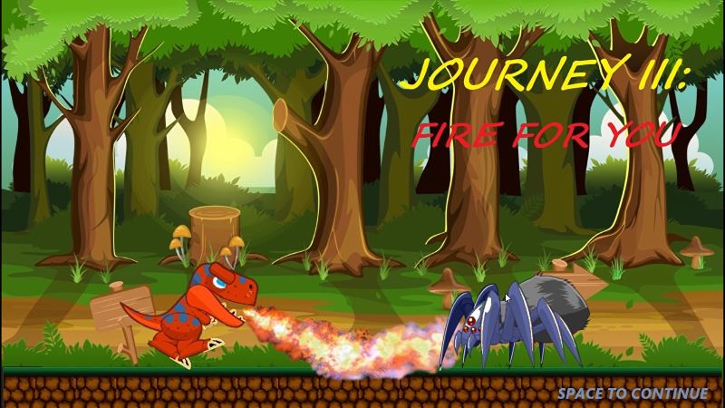
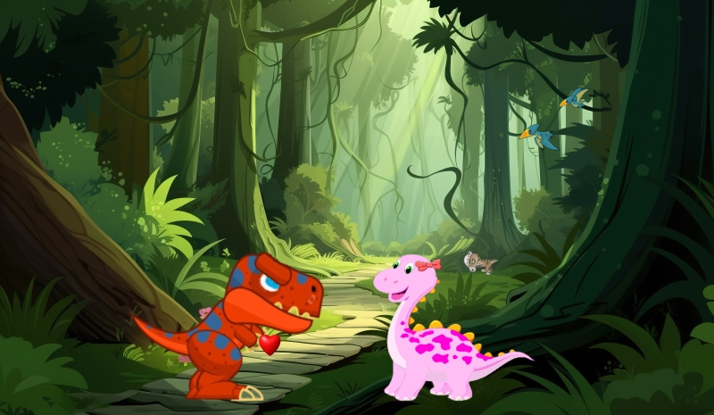

---
## 3. CÁC THAO TÁC TRONG GAME
### 1. Khởi động game, chơi lại và thoát game:

#### ***Ở mục MENU:***
    + Nhấn chọn START để bắt đầu chơi
    + Nhấn chọn EXIT để thoát game
 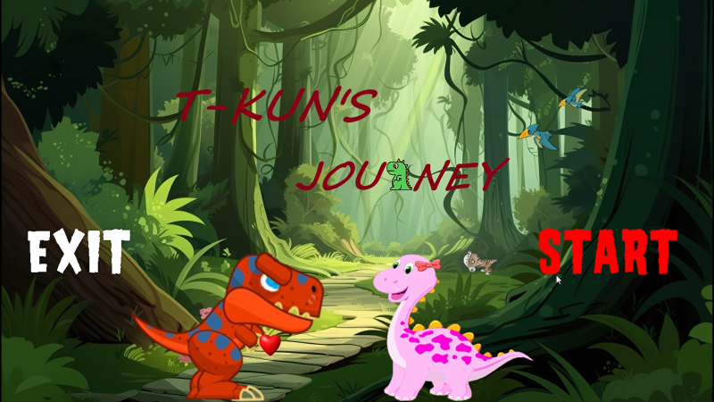

#### ***Khi vào game:***
    + Nhấn nút "X" ở góc phải window để thoát game
    + Khi thua: Nhấn phím SPACE để chơi lại, nhấn chọn dấu "X" ở góc trên bên phải để thoát game.
    + Khi hiện thông báo Journey: Nhấn phím SPACE để tiếp tục.
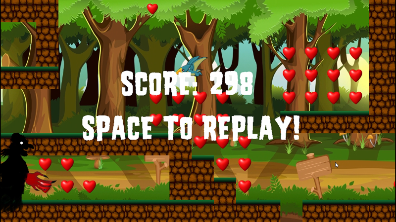
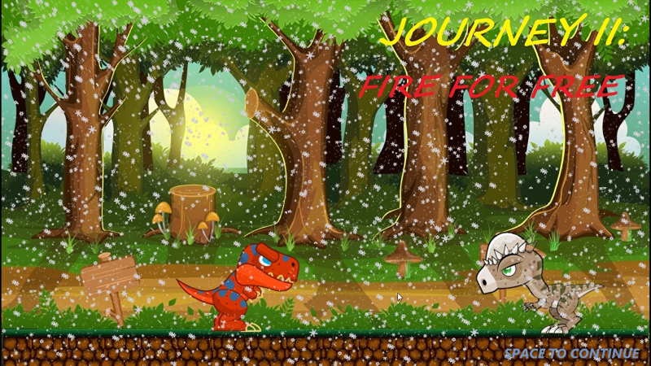

#### ***Khi "phá đảo":***
    + Nhấn phím SPACE để chơi lại.
    + Nhấn chọn dấu "X" ở góc trên bên phải để thoát game.

### 2. Cách chơi:
#### ***Sử dụng "bàn phím" và "chuột"***:
    + Phím "d": di chuyển sang phải
    + Phím "a": di chuyển sang trái
    + Phím "w": nhảy lên
    + Chuột trái: bắn đạn
**NOTE:** *Phím "a" không vô dụng như bạn nghĩ đâu, nó rất cần thiết đấy*
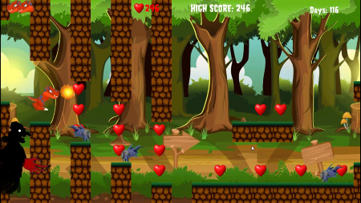  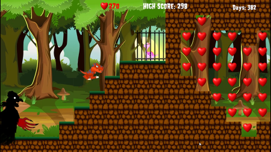

---
## 4. KỸ THUẬT LẬP TRÌNH
### ***Phát triển trên nền tảng ngôn ngữ C++ và thư viện SDL2:***
- SDL_Mixer: Hỗ trợ xử lý âm thanh.
- SDL_Ttf: Hỗ trợ xử lý fonts chữ.
- Các thư viện mở rộng C++.
- IDE Visual Code.

### ***Các kỹ thuật lập trình:***
- Gồm tất cả các kỹ thuật cơ bản:
- Biến (static, extern), vòng lặp, cấu trúc rẽ nhánh, mảng, chuỗi.
- Con trỏ, set, map, vector
- Class: Tạo, hủy, member function.
- Đọc viết file binary.
- Multithreading: Xử lý chức năng Battle.
- Tách file giấu code.
- Kỹ thuật duyệt mảng, sinh số ngẫu nhiên.
- Kỹ năng refac code.
- Các kỹ thuật, syntax của SDL.
- Kỹ thuật giải phóng bộ nhớ động.

### ***Ứng dụng:***
- Mỗi chức năng của game (Map, Main Player, Threats, Bullet, Text,...) được xác định bằng 1 đối tượng (class) riêng biệt.
-  Xây dựng Tile Map.
- Tạo hàm kiểm tra va chạm giữa các đối tượng.
- Tạo hàm kiểm tra va giữa đối tượng và map.
- Sử dụng Vector để lưu trữ Threats, Bullet...
- Sử dụng các vòng lặp để liên tục xử lý các sự kiện và hiển thị hình ảnh trong game.
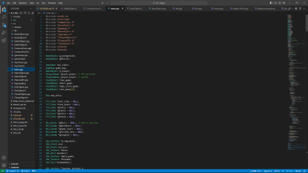  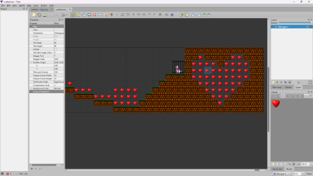

---
## 5. TÀI LIỆU THAM KHẢO
- [Khoá học của trường](https://courses.uet.vnu.edu.vn/course/view.php?id=10853)
- **https://lazyfoo.net/tutorials/SDL/**
- **https://www.youtube.com/watch?v=ObEOK7HSq2E**
- **https://phattrienphanmem123az.com/lap-trinh-game-cpp**
- **https://www.youtube.com/@PhatTrienPhanMem123AZ**
- **https://www.youtube.com/playlist?list=PLu4oc9P-ABcOXNOyoAvnMyUwn_kkiVA5B**
- **https://www.youtube.com/playlist?list=PL4cUxeGkcC9goXbgTDQ0n_4TBzOO0ocPR**
---
## 6. CÁC HƯỚNG ĐI TRONG TƯƠNG LAI
### 1. Nâng cấp và cải thiện gameplay:
- Thêm các yếu tố mới như power-up, vũ khí, kỹ năng đặc biệt, hoặc các yếu tố điều khiển khác để làm phong phú gameplay.
- Tạo ra nhiều cấp độ (level) với độ khó tăng dần, hoặc thêm các yếu tố khác như boss battle.
### 2. Phát triển đồ họa và âm thanh:
- Nâng cấp đồ họa bằng cách thêm chi tiết cho môi trường, nhân vật, hoặc các hiệu ứng đặc biệt như ánh sáng và bóng đổ.
- Tạo ra âm thanh chân thực hơn, bao gồm nhạc nền, hiệu ứng âm thanh, và giọng nói của nhân vật (nếu cần).
### 3. Tích hợp câu chuyện và thế giới:
- Xây dựng một cốt truyện chi tiết để giúp người chơi hiểu thêm về nhân vật và thế giới trong game.
- Thêm các đoạn cắt cảnh (cutscene) hoặc văn bản kể chuyện để làm cho game thêm hấp dẫn.
### 4. Tích hợp tính năng mạng xã hội hoặc multiplayer:
- Cho phép người chơi chia sẻ tiến trình hoặc kết quả chơi của mình trên mạng xã hội.
- Thêm chế độ multiplayer cho phép người chơi cạnh tranh hoặc hợp tác với nhau.
### 5. Xây dựng cộng đồng và marketing:
- Tạo ra các kênh truyền thông xã hội cho game của bạn để kết nối với người chơi và nhận phản hồi.
- Tổ chức các sự kiện, cuộc thi hoặc chương trình beta để thu hút sự chú ý và xây dựng cộng đồng người chơi.
### 6. Phát triển lên các nền tảng khác:
- Chuyển game sang các nền tảng khác như di động, console, hoặc VR để mở rộng tầm nhìn của bạn.
- Đảm bảo game tương thích với nhiều thiết bị và hệ điều hành khác nhau.
### 7. Tạo DLC hoặc phần tiếp theo:
- Phát hành các gói nội dung bổ sung (DLC) để tiếp tục giữ chân người chơi sau khi hoàn thành game chính.
- Lên kế hoạch cho phần tiếp theo hoặc một dự án game mới dựa trên thành công của game đầu tiên.
### 8. Tư bản hóa trò chơi: Hệ thống nạp tiền Pay to Play:
***Người chơi sẽ nạp tiền vào game, số tiền sẽ chuyển vào tài khoản nhà phát hành.***
***Tiền nạp sẽ chuyển hóa thành Coin với tỷ lệ tương ứng.***
Có thể dùng Coin để đổi các vật phẩm sau:
  - Skin cho nhân vật.
  - Theme UI game mới.
  - Theme Music game mới.
  - Tốn Coin để sử dụng Buff, giúp chiến thắng một cách dễ dàng, giảm đi áp lực cuộc sống.

---
## 7. KẾT LUẬN
Tất cả code trong game 100% do bản thân em viết, có sự tham khảo và học hỏi từ [Lazyfool](https://lazyfoo.net/tutorials/SDL/), [phattrienphanmem123az](https://phattrienphanmem123az.com/lap-trinh-game-cpp),...
### Việc hoàn thiện 1 dự án lập trình như thế này giúp em mở mang kiến thức rất nhiều:
- Hiểu được mô hình phát triển 1 phần mềm kiểu thác nước: Phân tích, thiết kế, lập trình, kiểm thử, chuyển giao và bảo trì (forever).
- Sử dụng thành thạo class, pointer, chia tách file,...
- Cách dùng github.
- Học rất nhiều syntax, thuật toán mới của c++.
- Hiểu sơ sơ một số khía cạnh của lập trình hướng đối tượng: kế thừa, đa hình,...
- Hình thành tư duy xử lý và giải quyết bài toán.
### Khuyết điểm:
- Code chưa được tối ưu hoàn toàn.
- Các syntax và thuật toán vẫn còn ngây ngô.
- Chưa refac code đến nơi đến chốn.
- Một vài hàm lặp lại do chưa chưa thể tổng hợp thành một hàm hoàn thiện để sử dụng chung.
### Lời kết:
Cuối cùng, em xin chân thành cảm ơn bố mẹ, ông bà, anh chị, các thầy cô à các bạn đã đồng hành cùng em suốt chặng đường hoàn thiện tựa Game "bom tấn" này.
Chúc các gamer có một trải nghiệm thú vị và đáng nhớ.

***A Special Thanks To:***
- Thầy Lê Đức Trọng.
- Thầy Trần Trường Thuỷ.
- Anh Nguyễn Trung Hiếu.
- Anh Đặng Tiến Dũng.
- Bạn Tẩn Vần Quyên.
- Và các các bạn lớp K68J 

***đã tạo động lực, đóng góp ý tưởng, giúp đỡ mình để sản phẩm tuyệt vời này được hoàn thiện.***

# Em xin chân thành cảm ơn thầy, cô, các bạn và mọi người đã dành thời gian để đọc. ❤️❤️

