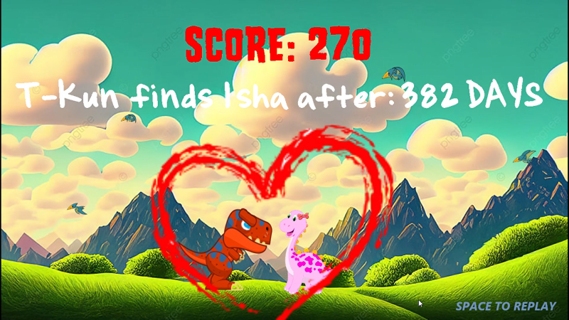

# **ゲーム: "T-Kun's Journey" - SDL2**
---
## ***ビデオデモ :***   
**https://www.youtube.com/watch?v=ZlPvO_iXwlE&t=568s**

---
## ***目次***
<!-- filepath: d:\_CODE_BANK\Project_\N_T_Nghia_GAME_2D\README.md -->
- [**ゲーム: "T-Kun's Journey" - SDL2**](#ゲーム-t-kuns-journey---sdl2)
  - [***ビデオデモ :***](#ビデオデモ-)
  - [***目次***](#目次)
  - [1. インストールガイド](#1-インストールガイド)
      - [**方法 1:**  ゲームを起動するには、`main.exe`ファイルをダブルクリックします。](#方法-1--ゲームを起動するにはmainexeファイルをダブルクリックします)
      - [**方法 2:** VSCodeでファイルをビルドします:](#方法-2-vscodeでファイルをビルドします)
  - [2. 概要](#2-概要)
    - [紹介](#紹介)
    - [ストーリー](#ストーリー)
  - [3. ゲーム内の操作](#3-ゲーム内の操作)
    - [1. ゲームの起動、再プレイ、終了:](#1-ゲームの起動再プレイ終了)
      - [***メニューで:***](#メニューで)
      - [***ゲームに入ると:***](#ゲームに入ると)
      - [***クリア時:***](#クリア時)
    - [2. ゲームの操作:](#2-ゲームの操作)
      - [***「キーボード」と「マウス」を使用:***](#キーボードとマウスを使用)
  - [4. 詳細はビデオデモで説明しています。](#4-詳細はビデオデモで説明しています)
    - [***C++言語とSDL2ライブラリを使用した開発:***](#c言語とsdl2ライブラリを使用した開発)
    - [***プログラミング技術:***](#プログラミング技術)
    - [***応用:***](#応用)
  - [5. 参考文献](#5-参考文献)
    - [参考文献:](#参考文献)
    - [画像、音声の出典:](#画像音声の出典)
  - [6. 将来の方向性](#6-将来の方向性)
    - [1. ゲームプレイのアップグレードと改善:](#1-ゲームプレイのアップグレードと改善)
    - [2. グラフィックとサウンドの改善:](#2-グラフィックとサウンドの改善)
    - [3. ストーリーと世界の統合:](#3-ストーリーと世界の統合)
    - [4. ソーシャル機能やマルチプレイヤーの統合:](#4-ソーシャル機能やマルチプレイヤーの統合)
    - [5. コミュニティの構築とマーケティング:](#5-コミュニティの構築とマーケティング)
    - [6. 他プラットフォームへの展開:](#6-他プラットフォームへの展開)
    - [7. DLCまたは続編の作成:](#7-dlcまたは続編の作成)
    - [8. ゲームのマネタイズ: ペイ・トゥ・プレイシステム:](#8-ゲームのマネタイズ-ペイトゥプレイシステム)
  - [7. 結論](#7-結論)
    - [このようなプログラミングプロジェクトを完成させることで、私は多くの知識を広げることができました。](#このようなプログラミングプロジェクトを完成させることで私は多くの知識を広げることができました)
    - [課題:](#課題)
    - [今後の改善点:](#今後の改善点)
- [読んでいただいたすべての皆様に心より感謝申し上げます。❤️❤️](#読んでいただいたすべての皆様に心より感謝申し上げます️️)

---
## 1. インストールガイド
***ゲームのダウンロードリンク:*** 
**https://drive.google.com/file/d/1yLTw8t-sJPpChuiPVr7DDYAAzELyCXZv/view?usp=sharing**
#### **方法 1:**  ゲームを起動するには、`main.exe`ファイルをダブルクリックします。
#### **方法 2:** VSCodeでファイルをビルドします:
        g++ -std=c++17 -static-libgcc -static-libstdc++ -Isrc/include -Lsrc/lib -o main src/main.cpp src/CommonFunc.cpp src/BaseObject.cpp src/gamemap.cpp src/MainObject.cpp src/ImpTimer.cpp src/BulletObject.cpp src/ThreatObject.cpp src/PlayHealth.cpp src/TextObject.cpp -lmingw32 -lSDL2main -lSDL2 -lSDL2_image -lSDL2_ttf -lSDL2_mixer

**コマンドで実行:** `./main`

---
## 2. 概要
### 紹介
- ゲーム "T-Kun's Journey" はプラットフォームゲームです。
- プレイヤーは、危険な地形を乗り越え、敵を倒して目的地に到達するために、常に柔軟に移動し続ける必要があります。
- 道中で「ハート」を拾い続けて、最高得点を獲得します。
- プレイヤーは4回以上死ぬと敗北し、目的地に到達すると勝利します。
  

### ストーリー
(ファンタジーの世界)

ジュラ紀の神秘的な世界、地上が森と谷で覆われていた時代、愛と勇気の感動的な物語がありました。

イシャという名前の恐竜の女の子は、いたずら好きで可愛らしく、遠い冒険を夢見ていました。

森の神の息子T-Rexは、イシャを初めて見た瞬間から彼女を愛していました。

イシャも密かにT-Rexを愛していたようで、よく一緒に探検し、親しみを込めて「T-Kun」と呼んでいました。二人は運命的に惹かれ合う魂でしたが、運命は彼らに危険な試練を与えました。

ある日、イシャが一人で森を訪れていた時、恐ろしいモンスター「DarkClaw」によって罠にかかってしまいました。DarkClawは凶暴で残忍なモンスターで、他の生き物を狩り、捕らえて食べてしまいます。

T-Rexはこのことを知り、じっとしていられませんでした。彼は自分の森を離れ、イシャを救う旅に出ることを決意します。愛と勇気の力がT-Rexを危険な試練へと導き、待ち受けるモンスター「Threats」を乗り越えていきます。

これからの道のりは困難と試練に満ちています... あなたはT-Kunがイシャを見つけられるよう、谷や迷宮を越え、Threatsを倒す手助けをしてください。

二人が再会する日は遠くありません... 諦めないでください！

---
## 3. ゲーム内の操作
### 1. ゲームの起動、再プレイ、終了:

#### ***メニューで:***
    + STARTを選択してゲームを開始します
    + EXITを選択してゲームを終了します
 

#### ***ゲームに入ると:***
    + ウィンドウの右上隅にある「X」ボタンを押してゲームを終了します
    + 負けた場合: SPACEキーを押して再プレイし、右上隅の「X」ボタンを選択してゲームを終了します。
    + 「Journey」メッセージ表示時：SPACEキーで続行

#### ***クリア時:***
    + SPACEキーを押して再プレイします。
    + 右上隅の「X」ボタンを選択してゲームを終了します。

### 2. ゲームの操作:
#### ***「キーボード」と「マウス」を使用:***
    + "d"キー: 右に移動
    + "a"キー: 左に移動
    + "w"キー: ジャンプ
    + 左クリック: 弾を発射
**注意:** 
+ 詳細はビデオデモで説明しています [Video Demo](https://www.youtube.com/watch?v=ZlPvO_iXwlE&t=568s).
+ *"a"キーは無駄ではありません、非常に重要です*

  

---
## 4. 詳細はビデオデモで説明しています。
***[Video Demo](https://www.youtube.com/watch?v=ZlPvO_iXwlE&t=568s) で各ファイルや関数を詳しく説明しています！!***
### ***C++言語とSDL2ライブラリを使用した開発:***
- SDL_Mixer: 音声処理をサポート。
- SDL_Ttf: フォント処理をサポート。
- 拡張C++ライブラリ。
- IDE Visual Code。

### ***プログラミング技術:***
- 基本的な技術を網羅
- 変数 (static, extern)、ループ、分岐構造、配列、文字列。
- ポインタ、set、map、vector
- クラス: 作成、破棄、メンバー関数。
- バイナリファイルの読み書き。
- マルチスレッド: バトル機能の処理。
- コードを隠すためのファイル分割。
- 配列の走査、乱数生成の技術。
- コードのリファクタリングスキル。
- SDLの技術、構文。
- 動的メモリ解放の技術。

### ***応用:***
- ゲームの各機能 (Map, Main Player, Threats, Bullet, Text,...) はそれぞれ独自のオブジェクト (クラス) として定義されています。
- タイルマップの構築。
- オブジェクト間の衝突を検出する関数の作成。
- オブジェクトとマップの間の衝突を検出する関数の作成。
- ベクターを使用してThreats、Bulletを保存します。
- ループを使用してゲーム内のイベントを継続的に処理し、画像を表示します。
 
  

---
## 5. 参考文献
### 参考文献:
- [学校のコース](https://courses.uet.vnu.edu.vn/course/view.php?id=10853)
- **https://lazyfoo.net/tutorials/SDL/**
- **https://www.youtube.com/watch?v=ObEOK7HSq2E**
- **https://phattrienphanmem123az.com/lap-trinh-game-cpp**
- **https://www.youtube.com/@PhatTrienPhanMem123AZ**
- **https://www.youtube.com/playlist?list=PLu4oc9P-ABcOXNOyoAvnMyUwn_kkiVA5B**
- **https://www.youtube.com/playlist?list=PL4cUxeGkcC9goXbgTDQ0n_4TBzOO0ocPR**
### 画像、音声の出典:
- **https://www.shutterstock.com/vi/**
- **https://pixabay.com/vi/**
---
## 6. 将来の方向性
### 1. ゲームプレイのアップグレードと改善:
- 新しい要素を追加してゲームプレイを豊かにする (パワーアップ、武器、特別なスキル、または他のコントロール要素)。
- 難易度が徐々に上がる複数のレベルを作成するか、ボスバトルなどの他の要素を追加します。
### 2. グラフィックとサウンドの改善:
- 環境、キャラクター、または光や影のような特殊効果の詳細を追加することでグラフィックをアップグレードします。
- バックグラウンドミュージック、効果音、キャラクターの声 (必要に応じて) を含む、よりリアルなサウンドを作成します。
### 3. ストーリーと世界の統合:
- プレイヤーがゲーム内のキャラクターや世界をより理解できるように、詳細なストーリーを構築します。
- ゲームをより魅力的にするために、カットシーンやナレーションテキストを追加します。
### 4. ソーシャル機能やマルチプレイヤーの統合:
- プレイヤーが自分の進行状況や結果をソーシャルメディアで共有できるようにします。
- プレイヤーが競争したり協力したりできるマルチプレイヤーモードを追加します。
### 5. コミュニティの構築とマーケティング:
- プレイヤーとつながり、フィードバックを受け取るために、ゲームのソーシャルメディアチャンネルを作成します。
- イベントやコンテスト、ベータテストで注目度・コミュニティ拡大
### 6. 他プラットフォームへの展開:
- ゲームをモバイル、コンソール、VRなどの他のプラットフォームに移植して視野を広げます。
- ゲームがさまざまなデバイスやオペレーティングシステムと互換性があることを確認します。
### 7. DLCまたは続編の作成:
- メインゲームをクリアした後もプレイヤーを引き留めるために、追加コンテンツ（DLC）をリリースします。
- 最初のゲームの成功に基づいて続編や新しいゲームプロジェクトの計画を立てます。
### 8. ゲームのマネタイズ: ペイ・トゥ・プレイシステム:
***プレイヤーはゲームに課金し、金額は運営者の口座に振り込まれます。 課金はコインに変換され、対応するレートで使用可能。 コインで交換できるアイテム：***
プレイヤーはコインを使用して以下のアイテムと交換できます。
  - キャラクターのスキン。
  - 新しいゲームのUIテーマ。
  - 新しいゲームのテーマ音楽。
  - バフを使用するためにコインを消費し、勝利を容易にし、生活のストレスを軽減します。

---
## 7. 結論
ゲーム内のすべてのコードは100％自分で書いたものであり、[Lazyfool](https://lazyfoo.net/tutorials/SDL/)や[phattrienphanmem123az](https://phattrienphanmem123az.com/lap-trinh-game-cpp)からの参考や学びが含まれています。
### このようなプログラミングプロジェクトを完成させることで、私は多くの知識を広げることができました。
- ウォーターフォール型ソフトウェア開発モデルの理解: 分析、設計、プログラミング、テスト、移行、保守（永続的）。
- クラス、ポインタ、ファイル分割の熟練した使用。
- GitHubの使い方。
- C++の新しい構文やアルゴリズムを多く学びました。
- オブジェクト指向プログラミングのいくつかの側面をざっくり理解しました: 継承、多態性、...
- 問題を処理し解決するための思考を形成しました。
### 課題:
- コードは完全に最適化されていません。
- 構文やアルゴリズムはまだ未熟です。
- コードのリファクタリングが不十分です。
- 一部の関数は、共通で使用するための完全な関数に統合できていないため、繰り返し使用されています。
### 今後の改善点:
- コードの最適化を進め、パフォーマンスを向上させる。
- 構文やアルゴリズムの理解を深め、より洗練された実装を目指す。
- コードのリファクタリングを行い、可読性と保守性を向上させる。

***特別な感謝を捧げます***
- レ・ドゥック・チョン先生
- グエン・チュン・ヒエウさん
- ダン・ティエン・ズンさん
- タン・ヴァン・クエンさん
- K68Jクラスの皆さん

***このプロジェクトを完成させるために、モチベーションを与え、アイデアを提供し、サポートしてくれたことに感謝します。***

# 読んでいただいたすべての皆様に心より感謝申し上げます。❤️❤️

